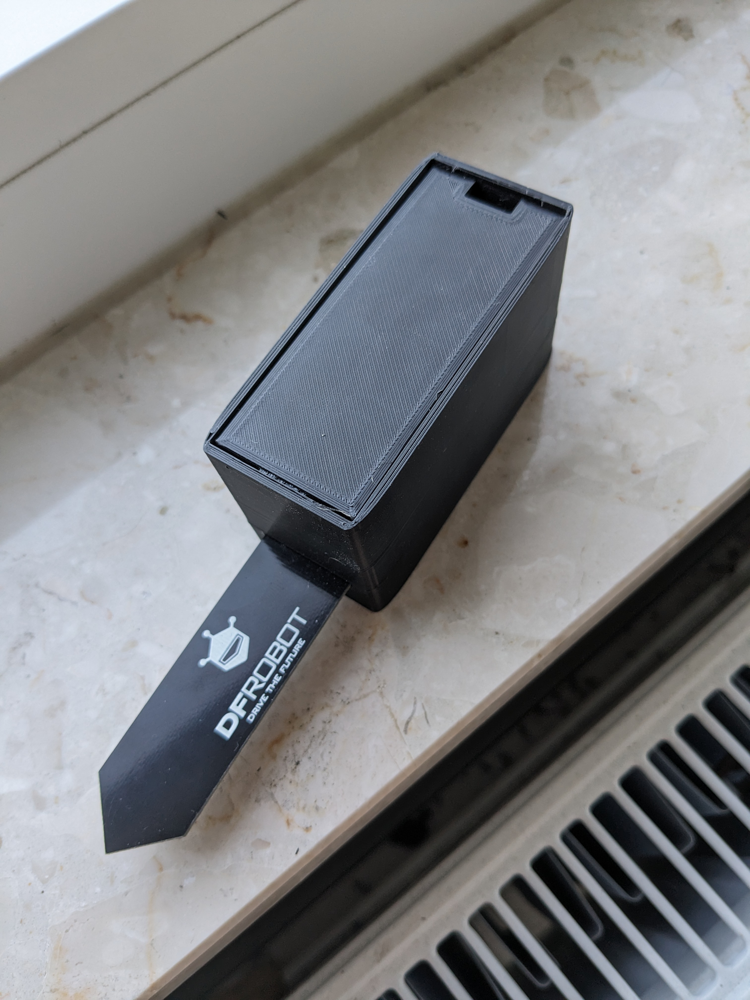
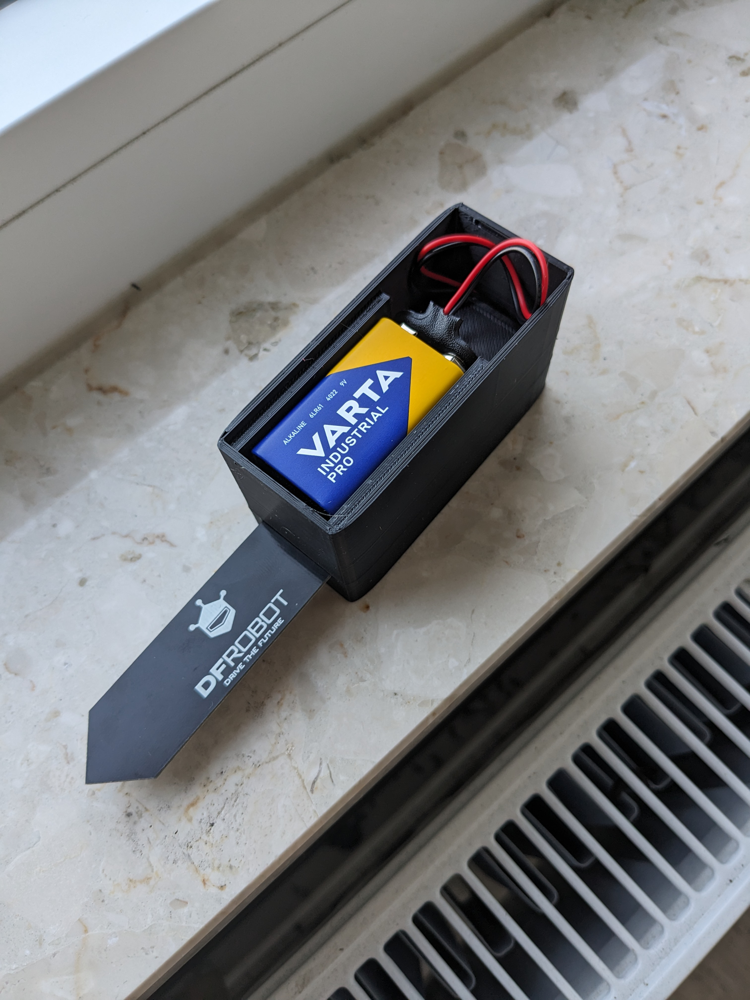
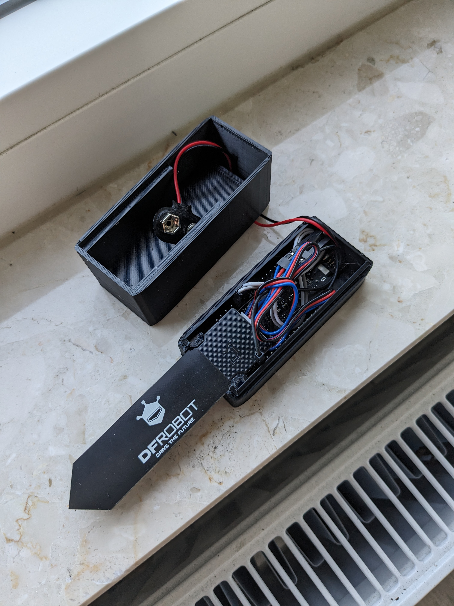
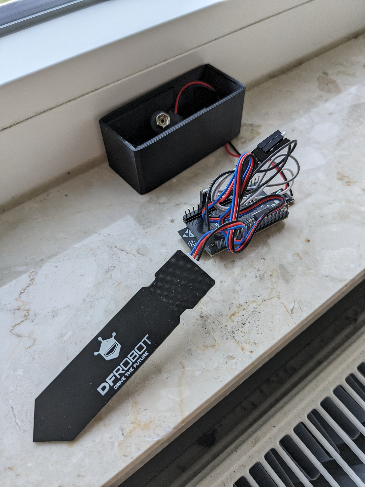
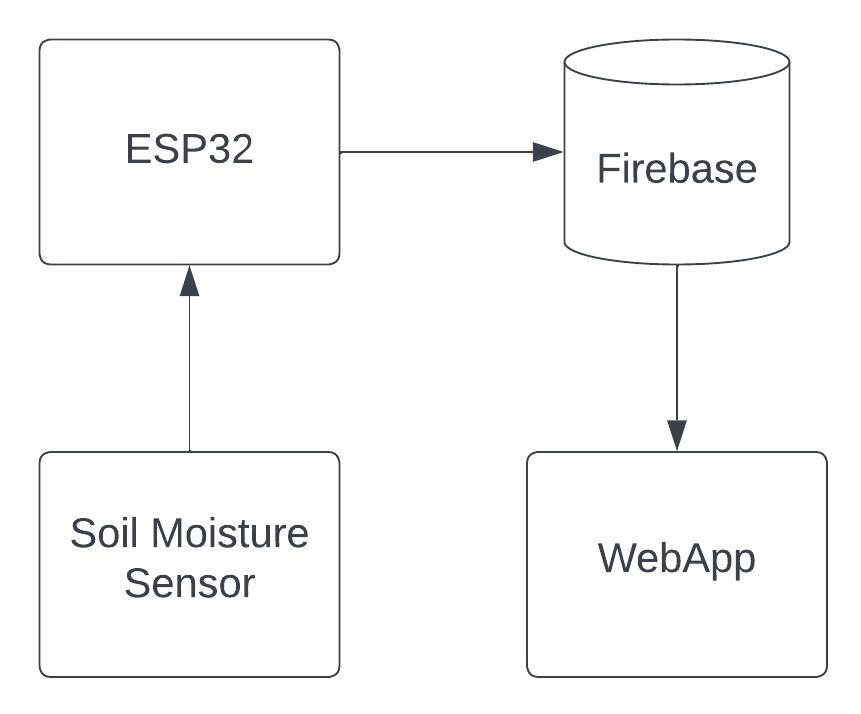

# Plant_Monitor
The project aimed to create a plant moisture monitoring system to enable more regular watering adapted to external conditions.

Project structure:
- . / case_stl - contains STL files of the case
- . / images - contains images of the sensor
- . / Plant_Monitor - contains the code which should be compiled and upload to ESP32
    - . / Plant_Monitor / config.hpp
    - . / Plant_Monitor / time.hpp
    - . / Plant_Monitor / time.cpp
    - . / Plant_Monitor / main.cpp
- . / Plant_Monitor_UI - contains webapp code
    - . / Plant_Monitor_UI / index.html - main page (with usage of Bootstrap library)
        - . / Plant_Monitor_UI / icons
        - . / Plant_Monitor_UI / static
        - . / Plant_Monitor_UI / scripts
            - . / Plant_Monitor_UI / scripts / init_firebase.js - data to connect to Firebase
            - . / Plant_Monitor_UI / scripts / login.js - login and authorization features
            - . / Plant_Monitor_UI / scripts / plots.js - query database and create plots

## Hardware
Setup contains following elements:
- ESP32-WROVER-E CAM
- DFRobot Gravity Analog Capacitive Soil Moisture Sensor
- 9V battery
- microUSB 2.0 to 9V battery connector
- 3D printed case
  

  

## Architecture

**ESP32-WROVER-E CAM:**  
Used to operate the soil moisture sensor and data transfer to the database via WiFi. Powered by a microUSB 2.0 port directly from a 9V battery. The moisture sensor is analog and the measurement of the current value is carried out by a GPIO with a built-in ADC. A digital GPIO is used to power the sensor. This is possible due to the fact that the sensor itself has a very low power consumption. An important functionality of the ESP32 used here is the deep sleep mode, which allows to wake up the chip every 3 hours and in the remaining time using a minimum of current.

**Hosting:**  
The webpage is hosted using Firebase Hosting.

**Database:**  
The Firebase Firestore service is used to store the data.